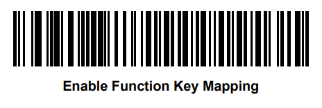
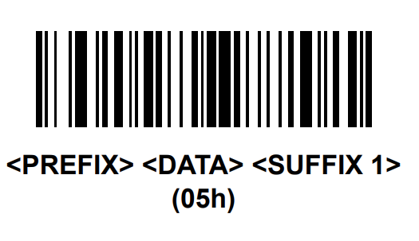
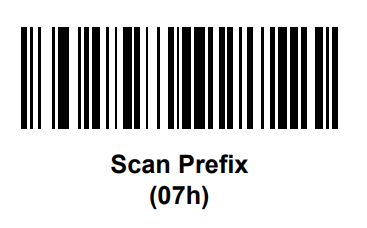
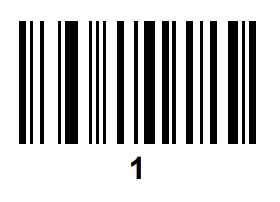
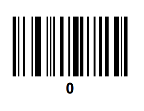
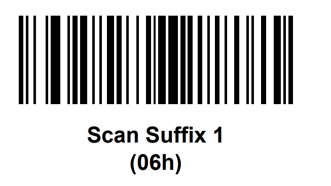
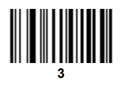

PHP app to keep track of inventory in my beer fridge.

"supports" a USB barcode scanner to add/remove inventory.

If untappd ever approves me, I'll probably integrate with that.

Not the greatest example of secure code, but if you're on my network I don't really care...

Definitely don't expose this to the internet!

== Barcode Scanner Setup ==
This was tested with a Symbol DS3508 - but anything that supports the relevant configuration options and emulates a keyboard should work.

Config:

* Prepend barcodes with a Ctrl + 2 character
* Append barcodes with a ENTER character

For the 3508, scan these in order:

* 
* 
* 
* 
* 
* 
* 
* 
* 
* 
* 
* 
