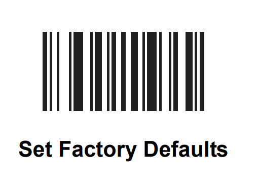

PHP app to keep track of inventory in my beer fridge.

Supports a USB barcode scanner to add/remove inventory.

Untappd integration is there - sadly the current (2020-11-08) API doesn't appear to support searching by UPC, so we can't just auto-populate based on the scanned barcode.

Not the greatest example of secure code, but if you're on my network I don't really care...

Definitely don't expose this to the internet!

The /help.php page contains some useful barcodes - printing this is probably the best bet, scanning from screens is kinda.. flakey.

== Barcode Scanner Setup ==
This was tested with a Symbol DS3508 - but anything that supports the relevant configuration options and emulates a keyboard should work.  This configuration lets the barcode scanner submit text as long as the tab/browser is in the foreground, regardless of what the user is doing (although if something is scanned it'll blow away whatever's on the page).

Config:

* Prepend barcodes with a Ctrl + 2 character
* Append barcodes with a ENTER character

For the 3508, scan these in order:

* 
* 
* 
* 
* 
* 
* 
* 
* 
* 
* 
* 

If this was a new barcode scanner to you, you should factory reset it with the following (before scanning all of the above):

== Untappd API Setup ==

* define UNTAPPD_CLIENT_ID and UNTAPPD_CLIENT_SECRET in config.php
* https://untappd.com/oauth/authenticate/?client_id=CLIENTID&response_type=code&redirect_url=http://path_to_app/auth.php
** note: auth.php doesn't exist, all you need is the 'code' parameter from the URL
* define UNTAPPD_USER_CODE from the auth output (untappd says this never expires)
